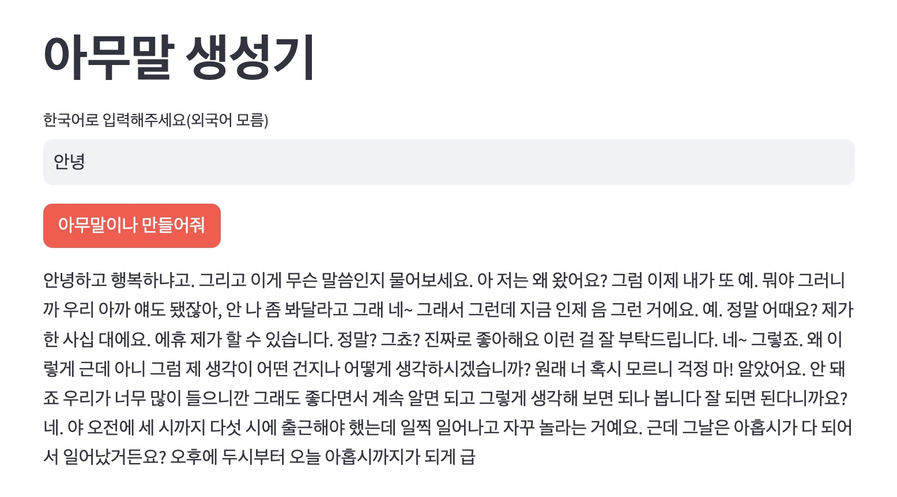
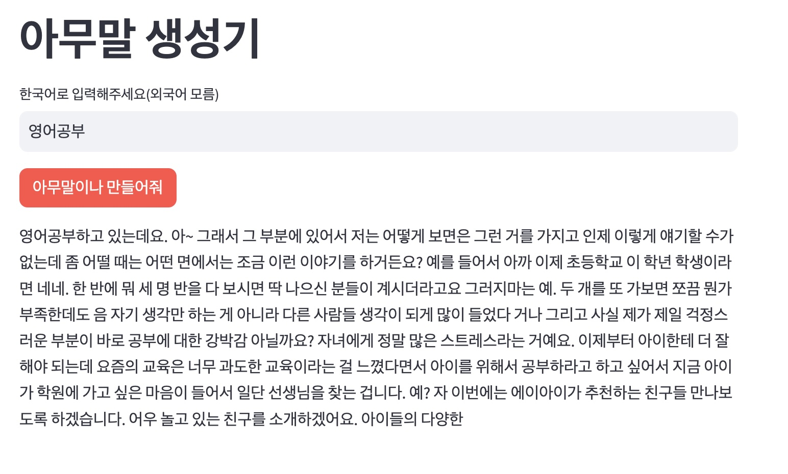

# 아무말 생성기

+ 허깅페이스에 공개되어 있는 skt/kogpt2-base-v2 모델과 streamlit 을 이용해서 초간단하게 webapp 구성해본 토이프로젝트

## 기능

사용자가 입력한 텍스트에 이어서 아무말 생성을 한다.

### 예시(exmple)

## 참고
+ Apple M2 PRO 32GB 로컬환경에서는 1초이내 응답이 됬음.
+ share.streamlit.io 에 배포를 해봤으나 무료플랜 RAM 1GB 환경에서는 아무말이나 만들어줘 버튼클릭시 App이 그대로 뻗어버리며 구동불가
+ 도커로 구동테스트해보니 CPU랑 메모리 사용량 옵션을 조정해서 일정수치 이상 할당하지 않으면 속도가 엄청나게 느려서 사용하기 힘듬

> 구동환경의 컴퓨터 사양이 어느정도 필요

